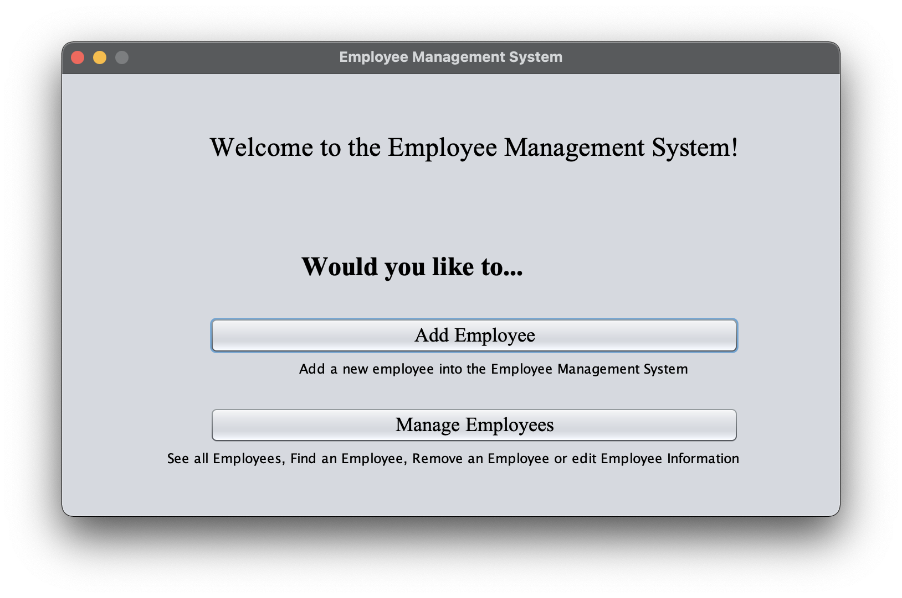
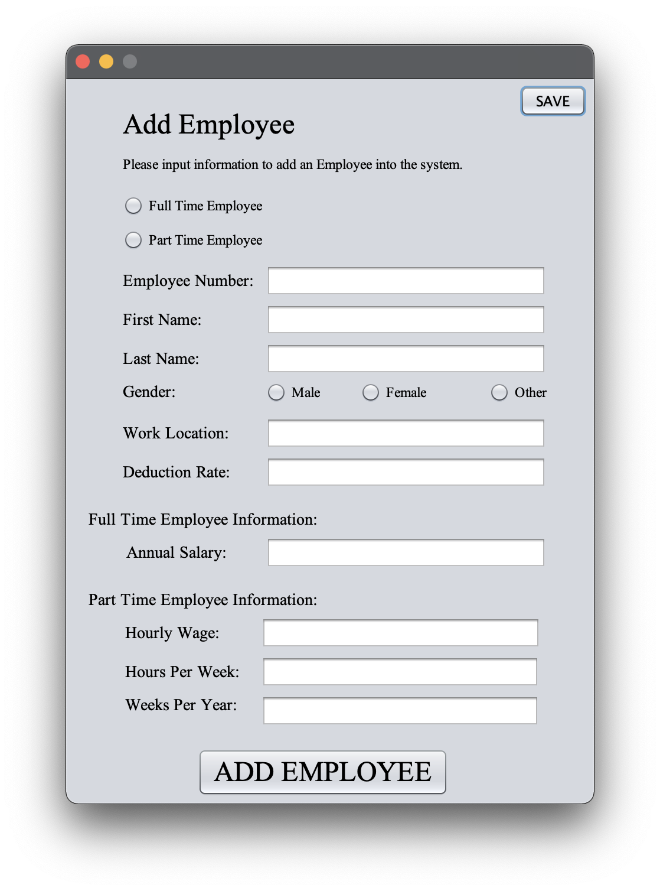
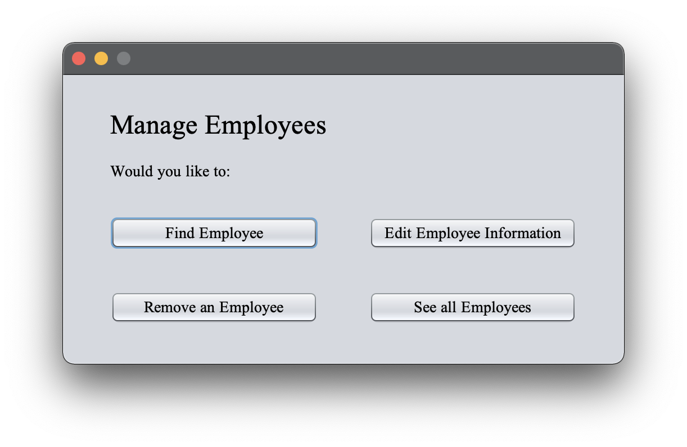
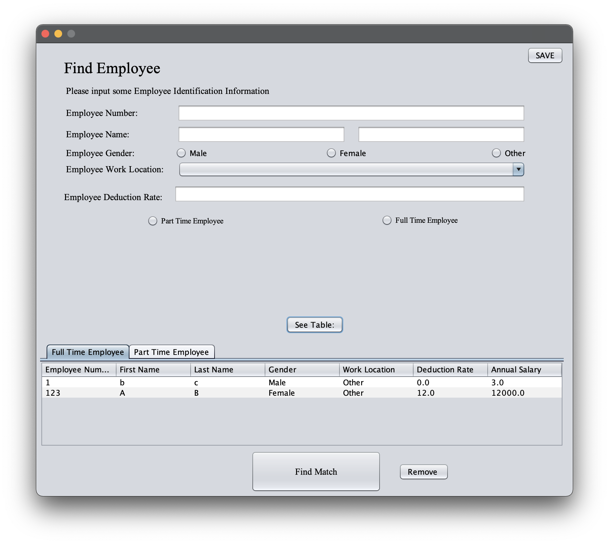

# README
### Daniel Brestoiu Employee Management System
This is an Employee Management System I made a few years ago.

It was a project meant to help develop my skills and get accustomed to Java.

### Sample Images
Welcome Screen:

  

Add Employees Screen:

Manage Employees Reroute screen:

  

Manage Employee Information:

  
#### Versioning:
This is the only available version, and is unlikely to get updates.
  
#### License:
This is licensed under the MIT License

### Authors:
Daniel Brestoiu